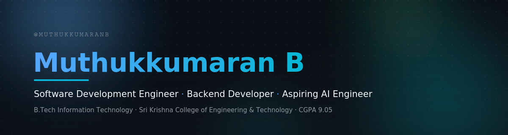

 

[Portfolio](https://muthukkumaranb.github.io/portfolio/) · [LinkedIn](https://linkedin.com/in/muthukkumaranb) · [Gmail](mailto:mailtomuthukkumaranb@gmail.com) · [GitHub](https://github.com/muthukkumaranb)

 

## About Me

I'm a second-year Information Technology student at Sri Krishna College of Engineering and Technology, building toward a career as a Software Development Engineer and AI Engineer. I have hands-on backend and full-stack development experience in Python/Django, strong Data Structures & Algorithms fundamentals, and applied AI/CV work — including local LLM integration and real-time computer vision.

My flagship project is a full-stack modular ERP system spanning 14 business domains, and I've competed in 10+ hackathons, reaching the finals in three.

<table>
<tr>
<td width="50%" valign="top">

**Currently open to**
- Software Development Engineer (SDE) roles
- Backend Developer roles
- Full-Stack Developer roles
- AI Engineering roles *(aspiring)*

</td>
<td width="50%" valign="top">

**Quick facts**
- B.Tech IT · SGPA 9.05/10.0
- 3x Hackathon Finalist
- 50+ DSA problems solved
- Shipped 3 full-stack projects

</td>
</tr>
</table>

 

## Tech Stack

| Category | Stack |
|---|---|
| Languages | Java, C++, C, Python |
| Frontend | HTML, CSS, JavaScript, Tailwind CSS |
| Backend | Django, SQLite, Python |
| Tools | Git, GitHub, VS Code |

 

## Applied AI & Computer Vision

*Hands-on integration of AI/CV tooling in shipped projects — actively building toward deeper ML/AI engineering skills.*

| | |
|---|---|
| Computer Vision | Real-time hand tracking & gesture recognition with MediaPipe and OpenCV — *Air Canva* |
| Local LLM Integration | Ollama-powered in-app voice assistant — *Mini ERP System* |
| Data Structures & Algorithms | Arrays, linked lists, trees, graphs, DP, sorting — practiced on LeetCode & HackerRank |
| Backend & APIs | CRUD operations, Django models, dynamic routing, authentication |

 

## Featured Projects

<b>Mini ERP System</b> — <i>Django · HTMX · Alpine.js · Tailwind CSS · SQLite · Celery · Ollama</i>

 

> A full-stack, modular ERP application spanning 14 business domains — built end-to-end with Git branching strategies and collaborative commit workflows. *June 2026*

| | |
|---|---|
| **Scope** | Sales, purchase, inventory, manufacturing, procurement, delivery, foreign trade, blockchain-based supply chain tracking |
| **Interface** | Reactive, AJAX-driven UI via HTMX + Alpine.js — no heavy JS framework |
| **AI Feature** | Local LLM (Ollama) powering an in-app voice assistant |
| **Engineering** | Audit logging, real-time dashboards, Celery-based background tasks |
| **Repo** | [github.com/muthukkumaranb/minierp](https://github.com/muthukkumaranb/minierp) |

<b>Platter to Purpose</b> — <i>Python · Django · HTML5 · CSS3 · JavaScript</i>

 

> A full-stack community platform connecting users to social resources, support services, and volunteer opportunities. *February 2026*

| | |
|---|---|
| **Backend** | User authentication, database models, dynamic routing, CRUD operations |
| **Frontend** | Responsive, mobile-first, cross-browser compatible, accessibility best practices |
| **Repo** | [github.com/muthukkumaranb/platter_to_purpose](https://github.com/muthukkumaranb/platter_to_purpose) |

<b>Air Canva</b> — <i>Python · MediaPipe · OpenCV · NumPy</i>

 

> A gesture-controlled virtual drawing app that turns webcam-tracked hand movement into a digital canvas. *December 2025*

| | |
|---|---|
| **Core Feature** | Gesture-controlled drawing from real-time hand movements |
| **Tracking** | Real-time hand tracking + finger detection for drawing, erasing, colour selection |
| **Processing** | OpenCV for video/frame processing, NumPy for pixel manipulation |
| **Repo** | [github.com/muthukkumaranb/aircanva](https://github.com/muthukkumaranb/aircanva) |

 

## Experience

**Technical Trainer Intern** · CSC Computer Education, Erode
 
Apr 2026 — May 2026

- Trained 50+ students in Python, C, and C++ through structured technical sessions and hands-on lab exercises
- Designed practice problem sets and doubt-clearing sessions that strengthened students' problem-solving fundamentals
- Received a certificate of excellence for communication and technical delivery

 

## Achievements & Hackathons

Competed in 10+ hackathons, reaching the finals at three national-level events, and served as Student Hackathon Coordinator for B.Tech IT at Sri Krishna College of Engineering and Technology.

| Hackathon | Organizer | Result |
|---|---|---|
| Odoo x KAHE Coimbatore Hackathon | Odoo & Karpagam Institutions | Finalist |
| Samhita Hackathon | IT Dept, Madras Institute of Technology | Finalist |
| Hydro Hackathon | Dept. of Ocean Engineering, IIT Madras | Finalist |
| Sparkathon | EEE Department, CIT | Participant |
| UIDAI Data Hackathon | UIDAI | Participant |
| Road Safety Hackathon | IIT Madras | Participant |
| Socialis Impulsum *(non-hackathon event)* | IIT Madras | Participant |

 

## Education

**Bachelor of Technology — Information Technology**
 
Sri Krishna College of Engineering and Technology, India · 2025 – 2029 · SGPA 9.05/10.0

Relevant coursework: Data Structures and Algorithms · OOP with C++ · Discrete Mathematics · Computer Organization and Architecture · Operating Systems

 

## Coding Profiles

[LeetCode](https://leetcode.com/u/muthukumaranb/)

 

## Contribution Activity

 

## Current Focus

<table width="100%">
<tr>
<td width="25%" valign="top">

**Learning**
- Advanced DSA
- Backend architecture & REST API design
- Machine Learning fundamentals

</td>
<td width="25%" valign="top">

**Building**
- Full-stack AI-integrated apps
- Computer vision side projects

</td>
<td width="25%" valign="top">

**Exploring**
- Local LLM integration
- Modern reactive frontend patterns

</td>
<td width="25%" valign="top">

**Open to**
- SDE / Backend / Full-Stack
- AI Engineering *(aspiring)*

</td>
</tr>
</table>

 

## Let's Connect

[Portfolio](https://muthukkumaranb.github.io/portfolio/) · [Gmail](mailto:mailtomuthukkumaranb@gmail.com) · [LinkedIn](https://linkedin.com/in/muthukkumaranb) · [GitHub](https://github.com/muthukkumaranb)

 

*"Code is the closest thing we have to magic — write it with intention."*

